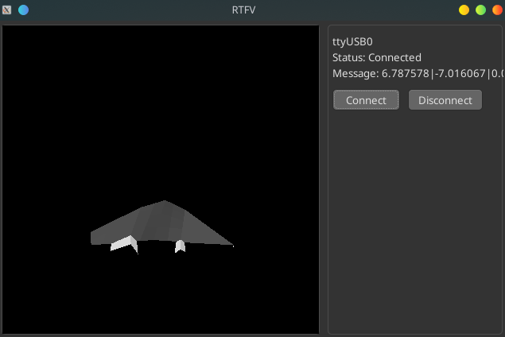

# RTFV
Hobby project to teach myself basics of wxWidgets and function as a way to visualize sensor fusion/filtering algorithms from another project.
Main functionality will be to read messages containing (a) device's orientation data and showcase that orientation in the 3D viewport.

 

See development branch to see the current progress.

## Requirements
- CMake to build
- wxWidgets
- OpenGL

## Build
Currently, only Debug build is "available" and tested (to run) only on the machine it is developed on (Manjaro Linux).
```
git clone
mkdir build
cd build
cmake ..
make
```
